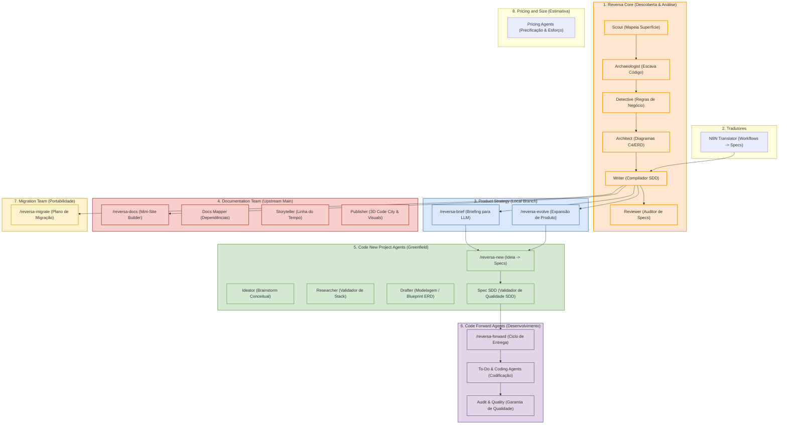
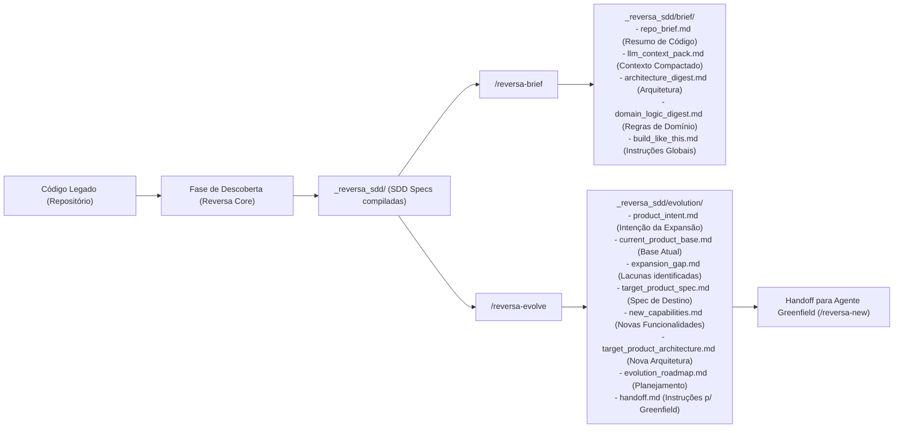

# Resume: Implementação /reversa-brief e /reversa-evolve & Integração de Upstream v1.2.44

## Status: ⚠️ EM INTEGRAÇÃO / AJUSTES DE CONFLITO
As funcionalidades dos agentes de **Product Strategy** foram concluídas com sucesso, mas a mesclagem recente do `main` (`v1.2.44`) introduziu novos times de agentes que geraram conflitos e sobrescreveram temporariamente as configurações de instalação locais.

---

## 🗺️ Arquitetura dos Agentes & Fluxos de Trabalho

### 1. Mapa Completo do Ecossistema Reversa (8 Teams)
Abaixo está o mapa de todos os **8 times especializados** do Reversa após a consolidação da branch local com as novidades da versão upstream `v1.2.44`.

### 2. Ciclo de Vida do Product Strategy
Como os novos comandos criados na branch local (`/reversa-brief` e `/reversa-evolve`) se posicionam em relação ao pipeline tradicional do Reversa:

---

## ✅ O Que Foi Feito

### 1. Criação do Time de Product Strategy (Branch Local)
- **`agents/reversa-brief/SKILL.md`**: Implementação do skill canônico para gerar um briefing condensado e "LLM-ready" do repositório legado analisado.
- **`agents/reversa-evolve/SKILL.md`**: Fluxo de inteligência de negócios para expansão do escopo de produtos (exemplo prático guiado de CRM -> CRM+ERP).
- **`agents/reversa-extract-soul/SKILL.md`**: Mantido como um alias retrocompatível e transparente direcionado para o `reversa-brief`.
- **Exemplos e Integrações de Visibilidade**:
  - `agents/reversa/references/step-02-resume.md` e `state-schema.md` atualizados na etapa `step-02-resume` para renderizar seções próprias de `brief` e `evolve`.
  - `agents/reversa-agents-help/SKILL.md` enriquecido com analogias e sequências sugeridas incluindo o fluxo de Product Strategy.

### 2. Mesclagem com Versão Upstream v1.2.44
A mesclagem da branch de desenvolvimento com o `origin/main` trouxe novos pacotes substanciais para o ecossistema do Reversa:
- **Documentation Team**: 5 agentes e 5 skills compartilhadas para gerar um mini-site HTML moderno, visual e interativo das especificações extraídas.
- **Code New Project Agents**: Pipeline completo de greenfield para criar novos projetos partindo de ideias abstratas até especificações estruturadas de SDD.
- **Estruturação de Layouts**: Atualizações visuais em diversos arquivos de documentação (`docs/documentation/*`, `docs/newproject/*`, `docs/forward/*`).

---

## ⚠️ O Que Falta Fazer (Pendente e Integração de Conflitos)

> [!IMPORTANT]
> A mesclagem com a versão upstream sobrescreveu os arquivos globais do instalador e navegação, apagando o grupo `PRODUCT_STRATEGY_TEAM` do instalador CLI. É fundamental restaurar a coexistência desses agentes.

### 1. Correção dos Conflitos e Restauração de Integração
- [ ] **Restaurar `lib/installer/prompts.js`**:
  - Declarar novamente o grupo `PRODUCT_STRATEGY_TEAM` contendo `reversa-brief`, `reversa-evolve`, `reversa-extract-soul`.
  - Exportar `PRODUCT_STRATEGY_AGENT_IDS`.
  - Incluir `product_strategy` no mapa `TEAM_TO_AGENTS` e o label `Product Strategy Agents` em `TEAM_LABELS`.
  - Adicionar o item no array `teamChoices` do prompt (marcado como `checked: true` por padrão).
- [ ] **Restaurar `lib/commands/install.js`**:
  - Importar `PRODUCT_STRATEGY_AGENT_IDS` de `prompts.js`.
  - Adicionar o cálculo `productStrategyInstalled` e mostrá-lo no resumo pós-instalação da CLI.
  - Adicionar as dicas de comandos pós-instalação para `/reversa-brief` e `/reversa-evolve`.
- [ ] **Ajustar `mkdocs.yml`**:
  - Re-adicionar a tradução e os links de menu para `Product Strategy Agents` e seus respectivos arquivos em `docs/product-strategy/*` sob o nó de navegação e dicionários multilíngues (PT, EN, ES).
- [ ] **Finalizar conflito em `docs/agentes/index.es.md`**:
  - Resolver pendência de indexação e adicionar o arquivo ao stage da mesclagem.

### 2. GitHub Issues e Testes (Fora do Escopo Inicial)
- [ ] **GitHub Issues Epic Tracking**: Criar manualmente os 4 Epics planejados (Bloqueado por falta de autenticação na CLI `gh` / MCP).
- [ ] **Testes Manuais do Pipeline Completo**:
  - Executar `npx reversa install` em ambiente de testes sandbox.
  - Verificar ativação por comandos das ferramentas de briefing e evolução.
  - Validar a compilação do MkDocs com o mini-site de documentação e novas abas integradas.

---

## 📊 Tabela de Conformidade do Plano Original

| Requisito do Plano | Status | Observação |
|:---|:---:|:---|
| **`/reversa-brief` como nome canônico** | ✅ | Concluído na branch local. |
| **`/reversa-extract-soul` como alias** | ✅ | Concluído na branch local. |
| **Saídas estruturadas em `_reversa_sdd/brief/`** | ✅ | Concluído na branch local. |
| **`/reversa-evolve` como fluxo de evolução** | ✅ | Concluído na branch local. |
| **Saídas estruturadas em `_reversa_sdd/evolution/`** | ✅ | Concluído na branch local. |
| **Telas de Ajuda integradas** | ✅ | Adicionado no `reversa-agents-help`. |
| **Coexistência com times do Upstream (v1.2.44)** | ❌ **Falha de Integração** | Sobrescrito na mesclagem. Requer restauração manual no instalador e MkDocs. |
| **Criação das GitHub Issues** | ⏳ **Pendente** | Bloqueado por credenciais do repositório remoto. |